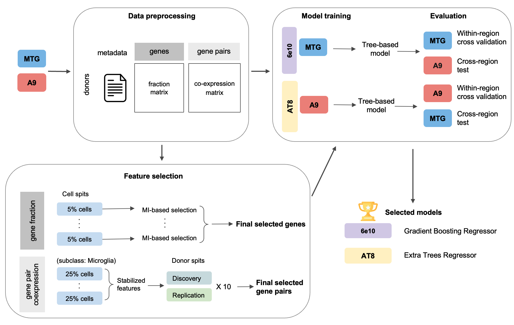
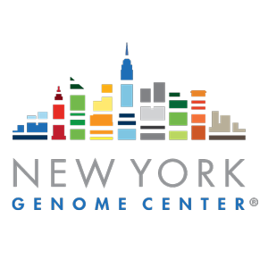

# Submitted Models for SEA-AD DREAM Challenge

This repository contains the complete workflow, scripts, and resources used to develop the models in the [**SEA-AD DREAM Challenge - Predicting Alzheimers Pathology from snRNA-seq Data**](https://www.synapse.org/Synapse:syn66496696/wiki/633729/).

**Summrary:** We developed supervised learning models to predict Alzheimer’s disease-associated neuropathological burden from single-nucleus transcriptomic data, integrating gene expression, co-expression, and donor-level metadata to capture signatures of pathology.

---

## 📋 Challenge Tasks

### Task 1: Disease Staging Prediction
Use single-cell RNA sequencing data to predict classical disease staging assessments that neuropathologists conduct using histopathological stains across the brain.

### Task 2: Protein Aggregate Quantification
Use single-cell RNA sequencing data to predict quantitative measures of protein aggregates and cellular stains from immunohistochemical data (6e10 and AT8 proteins).

---

## 🐳 Docker Images

Pre-built Docker containers for reproducible model execution:

- **Task 1**: https://github.com/th86/seaad_task1
- **Task 2**: https://github.com/th86/seaad_task2

---

## 🔬 Workflow Overview

The analysis pipeline consists of the following key steps:

### **Step 0: Data Preparation**

1. **`step0.1_generate_fractionMatrix_entire_data.py`**      
   Generates the fraction matrix for the entire MTG and A9 datasets, respectively.

2. **`step0.2_sampleData_supertype_5percentage.py`**      
   Performs subsampling to create **20 mutually exclusive subsets**, each representing 5% of the original dataset.

   * Each sample preserves the data distribution on supertypes.
   * All 20 samples collectively reconstruct the complete dataset.

3. **`step0.3_generate_fractionMatrix_for_5percentage.py`**       
   Generates a fraction matrix for each of the 20 subsampled datasets.

4. **`step0.4_compute_gene_pair_coexpression.py`**  **`step0.4_compute_gene_pair_coexpression.sh`**      
   Calculates cell-type-specific gene pair co-expression matrics using the full set or 4 subsamples of 25% cells (stabilized co-expression).

### **Step 1A: Feature Selection via Mutual Information (MI)**

5. **`step1.1_csv_fraction_supertype_train_MIs_6e10.R`**      
   Calculates MI-ranked genes for **6e10** protein levels across the 20 subsampled datasets.

6. **`step1.1_csv_fraction_supertype_train_MIs_AT8.R`**      
   Calculates MI-ranked genes for **AT8** protein levels across the 20 subsampled datasets.

7. **`step1.2_find_MI_features.Rmd`**     
   Integrates MI results and selects the final set of MI-based features used for model training.

### **Step 1B: Feature Selection for Gene Pairs**

8. **`step1B.1_prepare_donor_splits.py`**        
   Randomly split the donors into discovery and replication halves for 10 rounds    
   
9. **`step1B.2_select_pairs_10rounds.py`**  **`step1B.2_select_pairs_10rounds.sh`**         
   Select gene pairs based on the spearman's correlation between each gene pair's stabilized co-expression and the pathological target.
    
10. **`step1B.3_select_final_consensus_pairs.ipynb`**      
   Get the final consensus pair feature set.

### **Step 2: Model Training**

11. **`step2_final_model_6e10.ipynb`**       
   Trains the predictive model for **6e10** protein data.

12. **`step2_final_model_AT8.ipynb`**       
   Trains the predictive model for **AT8** protein data.

---

## 📚 Additional Resources

- **📝 Technical Writeup**: [View detailed methodology and results](https://www.synapse.org/Synapse:syn70755838/wiki/635604)
- **🏆 Challenge Information**: [SEA-AD DREAM Challenge](https://www.synapse.org/Synapse:syn66496696/wiki/633729/)

---

## 🛠️ Dependencies

The workflow requires the following environments:

* Python ≥ 3.12
* R ≥ 4.3

---

  
  &nbsp;&nbsp;&nbsp;&nbsp;
  

  <b>Columbia University</b> • <b>New York Genome Center</b>

